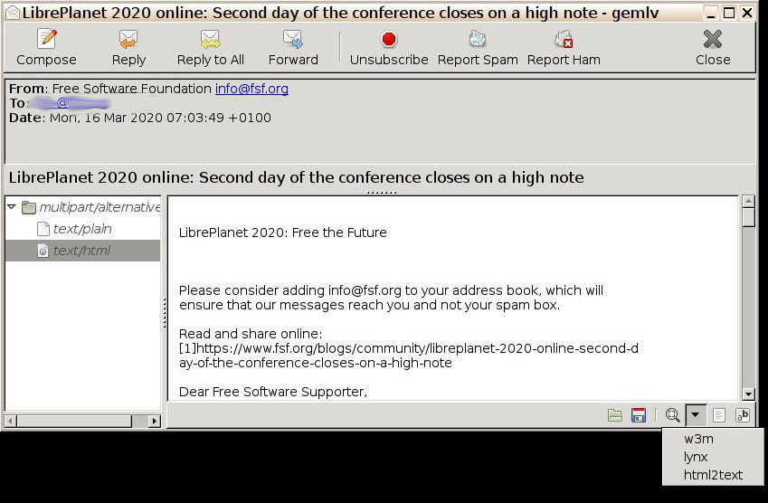

# gemlv
Email viewer and composer for local emails in GTK

## Screenshots





## Features

- display headers
	- only which are significant for end-users
	- highlight email addresses
	- convert Date to local timezone
	- Reply-By and Expires headers, show warning if time is over
	- switch to show all of the headers
- view plain text message, or a filtered attachment
	- configure multiple filters for non-text attachments
	- changable font or monospace on/off, font zoom
	- wrap lines, wrap letters, no wrap
	- show link for Content-Location if applicable
- display attachments and other MIME parts in tree view
	- select first text/plain or text/html part at beginning
	- show attached filenames, and their mime type
	- Drag-and-Drop from attachment panel
- email parts (attachments) can be opened with external program ([mimeopen-gui](https://github.com/bAndie91/mimeopen-gui))
- save attachments (MIME parts)
	- save as:
		- single files
		- more files at once in a folder
		- preserving multipart structure (ie. save in directory tree)
	- preverse modification time, permissions if specified in attachment
	- preserve symlinks
	- save Message-ID, Content-Type in Extended Attributes
- [Gravatar](http://www.gravatar.com/) support
	- you can configure the url to fetch an avatar picture for en email address:
		- files in precedence: `~/.config/gemlv/avatar_url_template`, `/etc/gemlv/avatar_url_template`
		- content: `https://www.gravatar.com/avatar/{email_md5}?default=404&size=64&rating=G`
		- template vars: `email`, `email_md5`
- button to unsubscribe from newsletters, mailing lists
- report as spam/ham
	- supported networks and filters
		- razor
		- pyzor
		- bogofilter
	- move Email file into / out from ```Spam``` folder
	- override spam-report command on user/system level (`~/.local/share/gemlv/report-spam`, `/etc/gemlv/report-spam`)
- writing Email
	- send by standard ```sendmail -ti``` command
		- can interrupt sending process
	- you can add usual headers (From, Reply-To, To, Cc, Bcc) and arbitrary ones as well
		- email address syntax is validated
		- pick date and time from calendar when adding date-time headers
	- can edit message by external program ([mimeopen-gui](https://github.com/bAndie91/mimeopen-gui))
	- options
		- set Importance and Priority by tool buttons
		- ask Disposition Notification by tool button
	- addressbook
		- read plain email addresses from file line by line (`~/Mail/.addressbook`)
- reply options
	- interpret Reply-To field
	- set References, In-Reply-To headers
	- quote plain text message in the new email
	- Reply To All: reply to sender, to all recipients, to the mailing list, except ourself
	- Reply To List
	- Forward: attach original email, not quote
	- send Disposition Notification on demand
		- even for messages have not requested it
		- it generates the response message conforming to the Accept-Language header (if it is translated)
	- store replied/forwarded/MDN-sent state in Extended Attribute
- attachments in compose mode
	- attach files, symlinks and even whole directories
		- by browsing them
		- by drag-and-drop
	- attach data blobs by drag-and-drop
	- rename attachments in place
	- remove attachments
	- reorder attachments
	- use that Transport Encoding which provides smaller encoded data for a given clear data
		- quoted-printable
		- base64
	- store file's modification time, permissions in Content-Disposition header
- CLI options
	- viewer mode (```gemlv raw_email.eml```)
	- compose mode (```gemlv --compose```)
	- addresses
		- ```--from '"Anna Ann" <me@example.net>'```
		- ```--to bud@example.net,Carl\ <carl@example.net>```
		- ```--cc ...```
		- ```--bcc ...```
	- subject (```--subject "..."```)
	- message body (```--message "..."```)
	- attachments (```--attach file1,file2,dir1,dir2```)
	- full ```mailto``` link (```--mailto "mailto:%22Buddy%22%20%3Cbud@example.net%3E?subject=awesome%20email%20client"```), RFC2368
- hotkeys
	- ```Ctrl-Q``` quit
	- ```Ctrl-W``` close compose window
	- ```Ctrl-S``` save attachment(s), save draft
	- ```Ctrl-Shift-S``` save draft as...
	- ```Ctrl-O``` open attachment with external program
	- ```Ctrl-N``` compose new Email
	- ```Ctrl-Shift-R``` Reply
	- ```Ctrl-R``` Reply to All
	- ```Ctrl-F``` Forward
	- ```Ctrl-U``` Filter/Unfilter
	- ```Ctrl-H``` Show/Hide headers
	- ```F4``` edit draft message with external program

## CLI options

```
usage: gemlv [-h] [--compose] [--from FROM] [--to ADDRESSES] [--cc ADDRESSES]
             [--bcc ADDRESSES] [--subject STRING] [--message STRING]
             [--mailto URL] [--attach FILES] [--localedir DIR]
             [--opener COMMAND]
             [FILE]

positional arguments:
  FILE              Raw Email file for read or continue editing (default:
                    None)

optional arguments:
  -h, --help        show this help message and exit
  --compose         Write a new Email (default: False)
  --from FROM       New Email's writer's name and address (default: None)
  --to ADDRESSES    New Email's Recipients, comma-separated list (default:
                    None)
  --cc ADDRESSES    Carbon Copy Recipients, comma-separated list (default:
                    None)
  --bcc ADDRESSES   Blind Carbon Copy Recipients, comma-separated list
                    (default: None)
  --subject STRING  Subject (default: None)
  --message STRING  Message body (default: None)
  --mailto URL      Full 'mailto:' link (default: None)
  --attach FILES    Attachments, comma-separated list (default: None)
  --localedir DIR   L10n base directory (default: None)
  --opener COMMAND  File opener command (default: mimeopen-gui)
```

## FAQ

**Q.** Support feature-rich HTML-rendering?

**A.** No. HTML-rendering is a huge job on its own right; does not fit into one program - one job paradigm for me.
I built in filters for several media types (including html), you can define more filter for one mime type
as well. Though it's not capable of feature-rich rendering with images, css, interactive content, nor 
anything like that. There are embedable libs for this purpose out there, but I doubt any html renderer engine
can work on the long-term on one hand, and I don't belive any reasonable ground to send so full-featured html 
around in emails on the other hand (except as attachments which you can open externally or just save).

**Q.** Where can I configure incoming/outgoing email server address/hostname/portnumber/ssl/tls/starttls options?

**A.** Nowhere. It's just a viewer for raw email files (and composer). You may setup an other program to
acquire your emails and save them in a directory, or use some virtual filesystem (fuse) which represents your 
IMAP/POP3 mailbox as a conventional filesystem. I personally donwload my emails by `getmail4` preserving IMAP
folder structure.

**Q.** I get error when about to send email. Why?

**A.** Consult the docs of your `sendmail` installation. If you have not any, install a tool providing
`sendmail` command; there are more of them.

**Q.** Why encryption and digital signing do not do anything?

**A.** They are not yet implemented. I do want to implement them.

**Q.** Python 2 ?

**A.** Yes. It is not banned. Is it?
